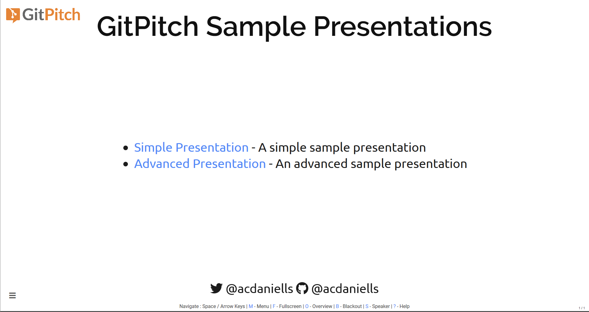

[](https://gitpitch.com/acdaniells/try-gitpitch)

# Try GitPitch

This project is for trying out the various free features of the *GitPitch* markdown presentation service. This service is often used by developers for creating modern slide shows.

*GitPitch* extends the capabilities of the hugely popular and powerful `Reveal.js` HTML presentation framework and combines it with the distributed and collaborative file management capabilities of *Git*.

## Getting Started

To get started with this project an account on *GitHub* is required.

<span style="font-size:1.2em;">**Step 1:** Fork this Repository</span>

Forking this repository will create a new `try-gitpitch` repository under your own *GitHub* account. Within your new repository you will find the basic file structure for a *GitPitch* slide show presentation:

```
.
├── PITCHME.md
├── PITCHME.yaml
└── assets/
    ├── css/
    │   └── PITCHME.css
    └── img/
        └── *.{jpg, png, gif}
```

Only a `PITCHME.md` markdown file is required to create a *GitPitch* slide show presentation. This is the file where you add the markdown content for your slides. Optional files, such as `PITCHME.yaml` and `PITCHME.css` can be added to activate custom settings and styles for your slide show.

<span style="font-size:1.2em;">**Step 2:** View the Slide Show</span>

Following a fork of the repository a `PITCHME.md` markdown file will be found in your new repository. This means that your first *GitPitch* slide show is immediately available at the following URL:

```
https://gitpitch.com/$USER/try-gitpitch
```

> You must substitute your *GitHub* account name for $USER in the above URL.

Using your slide show URL, go ahead and open your new slide show in the browser now. When you open your slide show you should see the first sample slide that should look a lot like this screen shot:



That's it for the first part of the try *GitPitch* tutorial.

If you are eager to jump straight back into the *GitPitch* Docs, click here. But if you want to learn a little more about how the sample presentation for this tutorial was created - and that's strongly recommended - then read on for additional details and tips.

### Markdown Basics

*Markdown* is a lightweight markup language with plain text formatting syntax that is often used to format readme files.

The [Mastering *Markdown* Guide](https://guides.github.com/features/mastering-markdown/) is a good resource to learn or refresh the basic usage of *Markdown* and the GitHub Flavoured Markdown (GFM) extensions.

### The PITCHME.md Convention

*GitPitch* introduces the `PITCHME.md` convention that automatically turns any `PITCHME.md` file found within a Git repository into a beautiful slide show presentation.

This convention gives developers a simple and convenient way to promote, pitch or present absolutely anything.

### Slide Delimiters

To split markdown content into a series of slides, presentation authors must use a special slide delimiter syntax. Each delimiter denotes the start of a new slide.

To create a new slide use the following delimiter syntax within your `PITCHME.md` file:

```
---
```

As both horizontal (default) and vertical slides are supported by *GitPitch* each has it's own unique delimiter syntax. To create a new vertical-slide use the following delimiter syntax within your `PITCHME.md` file:

```
+++
```

By using a combination of horizontal and vertical slide delimiters you can customize how your audience experiences and navigates content within your slide show presentation.

> Note: Typically horizontal slides present top-level information. Vertical slides are then used to drill-down.

### GitPitch Documentation

For more detailed documentation please use the links below.

* [My *GitPitch* documentation overview for free features](docs/GITPITCH.md)
* [The *GitPitch* official documentation](https://gitpitch.com/docs)

## Sample Presentations

This repository currently contains two sets of sample presentations located in the `talks` directory. The link to the corresponding slide show and documentation for each of these is given in the table below.

| Name     | Slide Show | Documentation |
|:-------- |:----------:|:-------------:|
| Simple   | [](https://gitpitch.com/acdaniells/try-gitpitch/master?p=talks/simple) | [](talks/simple/README.md) |
| Advanced | [](https://gitpitch.com/acdaniells/try-gitpitch/master?p=talks/advanced) | [](talks/advanced/README.md) |

## License

This project by Andrew Daniells is licensed under the [Creative Commons Attribution 4.0 International License](https://creativecommons.org/licenses/by/4.0/).


